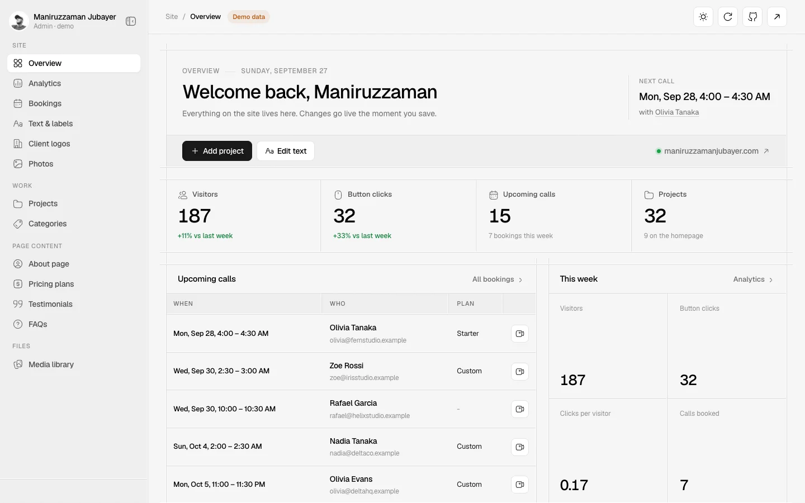
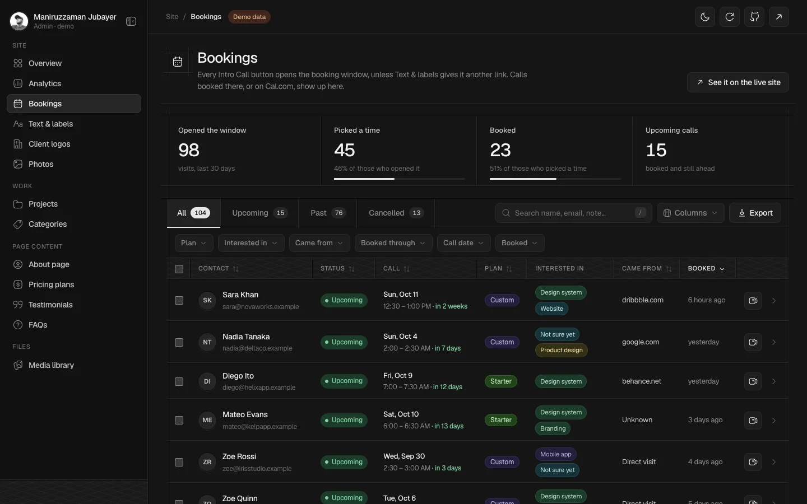

# Admin panel

An admin panel for a designer's portfolio site: projects, bookings, analytics, media and every line of text on the site, in one place. It is drawn in the site's own line art (engraved hairlines and a cross-hatch band instead of boxes), with a light and a dark theme.

Built by [Maniruzzaman Jubayer](https://maniruzzamanjubayer.com) for his portfolio, and open-sourced here with made-up data.

**Live demo:** _coming with the first deploy_





## What is in it

- **Overview**: this week's numbers, the next calls and every part of the site at a glance.
- **Bookings**: a CRM-style table of intro calls. Tabs, search, filters (plan, interests, source, call date, booked date), sortable columns, columns you can hide, bulk select, CSV export, and a side panel with everything about a booking.
- **Analytics**: first-party and cookie-free. Trends, the pricing funnel, button clicks, sources and campaigns, pages, time on page, scroll depth, a weekday by hour heatmap and the audience.
- **Projects**: drag to reorder (or use the keyboard), list and grid views, filter by category, homepage on/off per project.
- **Media library**: grid or table, sortable, upload by drag and drop.
- **Content**: text and labels, the About page, pricing plans, testimonials, FAQs, client logos, photos and categories. Long forms save from a sticky bar; lists open each item in a dialog.
- **Look and feel**: engraved line art, light, dark or the system's theme, a sidebar that collapses to icons, responsive down to a phone, Hugeicons throughout.

## How the demo works

The real admin runs on Cloudflare (Workers, D1, R2). This repo has no backend: the same SQLite schema runs in your browser with [sql.js](https://sql.js.org), filled with a year of made-up projects, bookings, visits and clicks. Every page and every save works, and nothing leaves the browser; refresh and it starts over.

- `lib/db.ts` is the database: it loads sql.js, creates the tables and seeds them.
- `lib/demo/schema.ts` is the schema, `lib/demo/seed.ts` the made-up data.
- `app/admin/actions.ts` holds every save and delete.
- `public/media/demo/` holds the artwork, drawn by `scripts/make-art.mjs` (no stock images).

Only the owner is real: the name, the photo and the profile links. Every project, client, person, booking and visit is invented.

## Run it

```bash
npm install
npm run dev
```

Then open [localhost:3000/admin](http://localhost:3000/admin).

## Make it yours for real

1. Put `lib/db.ts` back on a server database (D1, SQLite, Postgres). Keep `all`, `one`, `run` and `batch`; the queries are plain SQLite.
2. Mark `app/admin/actions.ts` with `"use server"` and guard each action with a real `requireAdmin()` in `lib/auth.ts`.
3. Point uploads (`app/admin/upload-client.ts`) at your storage.

## Built with

Next.js 16, React 19, CSS Modules, [Hugeicons](https://hugeicons.com) (free set), [dnd-kit](https://dndkit.com) and [sql.js](https://sql.js.org).

## License

[MIT](LICENSE), © Maniruzzaman Jubayer.
